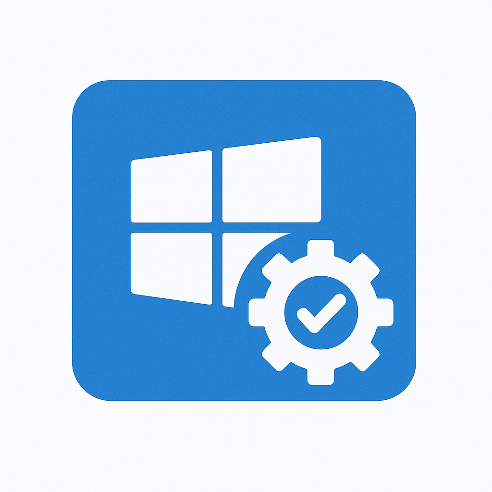

# 🚀 Windows Installer Generator (WIG)

<p align="center">
  
</p>

<p align="center">
  <b>Install and update multiple apps with one file!</b><br>
  Simplify software deployment on Windows with WIG.
</p>

---

## 🏷️ Badges

  
  
  


---

## 📑 Table of Contents

- [About the Project](#-about-the-project)
- [Getting Started](#-getting-started)
- [Screenshots / GIFs](#-screenshots--gifs)
- [How It Works](#-how-it-works)
- [Roadmap](#-roadmap)
- [Contributing](#-contributing)
- [License](#-license)
- [Acknowledgements](#-acknowledgements)

---

## 📖 About the Project

**Windows Installer Generator (WIG)** is a tool that allows you to package multiple applications into a single installer.  
It leverages **Winget** under the hood to automate installations and updates, saving you time and effort.

### ✨ Why WIG?

- Installing many apps on a new Windows machine is time-consuming.  
- Updating apps one by one is tedious.  
- WIG makes this process **automatic, fast, and repeatable**.  

### ✅ Features

- ✅ Bundle multiple apps into a single installer  
- ✅ Update apps with one click  
- ✅ Customizable app list with simple configs  
- ✅ Clean, lightweight, and fast  
- ✅ Works on any Windows machine with Winget  

---

## ⚡ Getting Started

### 🔧 Prerequisites

- 🖥️ Windows 10/11  
- 📦 [Winget](https://learn.microsoft.com/en-us/windows/package-manager/winget/) installed  

### 📥 Installation

Clone this repository:

```bash
git clone https://github.com/yourusername/WIG.git
cd WIG
```

Run WIG:

```bash
wig generate config.yaml
```

### ▶️ Example Usage

```yaml
apps:
  - Google.Chrome
  - VisualStudioCode
  - Spotify
```

Then run:

```bash
wig install config.yaml
```

---

## 🖼️ Screenshots / GIFs

> 🎥 Demo & screenshots coming soon!

<p align="center">
  
</p>

---

## ⚙️ How It Works

1. You provide a **YAML/JSON config** file with the apps you want.  
2. WIG uses **Winget** to fetch and install them.  
3. Generates a single **installer script/exe** you can share.  

### Example Config

```yaml
apps:
  - Firefox
  - 7zip.7zip
  - Git.Git
```

---

## 🗺️ Roadmap

- [ ] GUI version of WIG  
- [ ] Support for offline installers  
- [ ] Cross-platform support (Linux/macOS with Brew/apt)  
- [ ] Auto-update feature  

---

## 🤝 Contributing

Contributions are welcome! 🎉  
To contribute:

1. Fork the repo  
2. Create a new branch (`git checkout -b feature/YourFeature`)  
3. Commit changes (`git commit -m 'Add YourFeature'`)  
4. Push (`git push origin feature/YourFeature`)  
5. Open a Pull Request  

Please check the [issues](https://github.com/yourusername/WIG/issues) page for existing tasks.

---

## 📄 License

This project is licensed under the **MIT License** – see the [LICENSE](LICENSE) file for details.

---

## 🙏 Acknowledgements

- 📌 [Winget](https://learn.microsoft.com/en-us/windows/package-manager/) – Microsoft’s package manager  
- 📌 Inspiration from Chocolatey, Ninite, and other installers  
- 📌 Thanks to the open-source community 💙  

---

<p align="center">✨ Made with passion by MysteryT (Péter) ✨</p>
